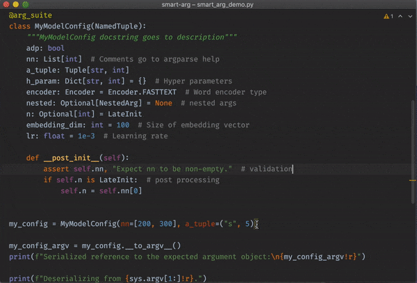

# Smart Argument Suite (`smart-arg`)

[](https://GitHub.com/linkedin/smart-arg/tags/)
[](https://pypi.python.org/pypi/smart-arg/)

Smart Argument Suite (`smart-arg`) is a slim and handy Python library that helps one work safely and conveniently 
with the arguments that are represented by an immutable argument container class' fields 
([`NamedTuple`](https://docs.python.org/3.7/library/typing.html?highlight=namedtuple#typing.NamedTuple) or 
[`dataclass`](https://docs.python.org/3.7/library/dataclasses.html#dataclasses.dataclass) out-of-box),
and passed through command-line interfaces.

`smart-arg` promotes arguments type-safety, enables IDEs' code autocompletion and type hints 
functionalities, and helps one produce correct code.



## Quick start

The [`smart-arg`](https://pypi.org/project/smart-arg/) package is available through `pip`.
```shell
pip3 install smart-arg
```

Users can bring or define, if not already, their argument container class -- a `NamedTuple` or `dataclass`,
and then annotate it with `smart-arg` decorator `@arg_suite` in their Python scripts.

Now an argument container class instance, e.g. `my_arg` of `MyArg` class, once created, is ready to be serialized by the `smart-arg` API --
`my_arg.__to_argv__()` to a sequence of strings, passed through the command-line interface 
and then deserialized back to an instance again by `my_arg = MyArg.__from_argv__(sys.argv[1:])`.

```python
import sys
from typing import NamedTuple, List, Tuple, Dict, Optional
from smart_arg import arg_suite


# Define the argument container class
@arg_suite
class MyArg(NamedTuple):
    """
    MyArg is smart! (docstring goes to description)
    """
    nn: List[int]  # Comments go to argparse help
    a_tuple: Tuple[str, int]  # a random tuple argument
    encoder: str  # Text encoder type
    h_param: Dict[str, int]  # Hyperparameters
    batch_size: Optional[int] = None
    adp: bool = True  # bool is a bit tricky
    embedding_dim: int = 100  # Size of embedding vector
    lr: float = 1e-3  # Learning rate


def cli_interfaced_job_scheduler():
    """
    This is to be called by the job scheduler to set up the job launching command,
    i.e., producer side of the Python job arguments
    """
    # Create the argument container instance
    my_arg = MyArg(nn=[3], a_tuple=("str", 1), encoder='lstm', h_param={}, adp=False)  # The patched argument container class requires keyword arguments to instantiate the class

    # Serialize the argument to command-line representation
    argv = my_arg.__to_argv__()
    cli = 'my_job.py ' + ' '.join(argv)
    # Schedule the job with command line `cli`
    print(f"Executing job:\n{cli}")
    # Executing job:
    # my_job.py --nn 3 --a_tuple str 1 --encoder lstm --h_param --batch_size None --adp False --embedding_dim 100 --lr 0.001


def my_job(my_arg: MyArg):
    """
    This is the actual job defined by the input argument my_arg,
    i.e., consumer side of the Python job arguments
    """
    print(my_arg)
    # MyArg(nn=[3], a_tuple=('str', 1), encoder='lstm', h_param={}, batch_size=None, adp=False, embedding_dim=100, lr=0.001)
    
    # `my_arg` can be used in later script with a typed manner, which help of IDEs (type hints and auto completion)
    # ...
    print(f"My network has {len(my_arg.nn)} layers with sizes of {my_arg.nn}.")
    # My network has 1 layers with sizes of [3].


# my_job.py
if __name__ == '__main__':
    # Deserialize the command-line representation of the argument back to a container instance 
    arg_deserialized: MyArg = MyArg.__from_argv__(sys.argv[1:])  # Equivalent to `MyArg(None)`, one positional arg required to indicate the arg is a command-line representation.
    my_job(arg_deserialized)
```

```shell-session
> python my_job.py -h
usage: my_job.py [-h] --nn [int [int ...]] --a_tuple str int --encoder str
                 --h_param [str:int [str:int ...]] [--batch_size int]
                 [--adp {True,False}] [--embedding_dim int] [--lr float]

MyArg is smart! (docstring goes to description)

optional arguments:
  -h, --help            show this help message and exit
  --nn [int [int ...]]  (List[int], required) Comments go to argparse help
  --a_tuple str int     (Tuple[str, int], required) a random tuple argument
  --encoder str         (str, required) Text encoder type
  --h_param [str:int [str:int ...]]
                        (Dict[str, int], required) Hyperparameters
  --batch_size int      (Optional[int], default: None)
  --adp {True,False}    (bool, default: True) bool is a bit tricky
  --embedding_dim int   (int, default: 100) Size of embedding vector
  --lr float            (float, default: 0.001) Learning rate

```
## Promoted practices
* Focus on defining the arguments diligently, and let the `smart-arg` 
  (backed by [argparse.ArgumentParser](https://docs.python.org/3/library/argparse.html#argumentparser-objects)) 
  work its magic around command-line interface. 
* Always work directly with argument container class instances when possible, even if you only need to generate the command-line representation.
* Stick to the default behavior and the basic features, think twice before using any of the [advanced features](https://smart-arg.readthedocs.io/en/latest/advanced.html#advanced-usages).


## More detail
For more features and implementation detail, please refer to the [documentation](https://smart-arg.readthedocs.io/).

## Contributing

Please read [CONTRIBUTING.md](CONTRIBUTING.md) for details on our code of conduct, and the process for submitting pull requests to us.

## License

This project is licensed under the BSD 2-CLAUSE LICENSE - see the [LICENSE.md](LICENSE.md) file for details
